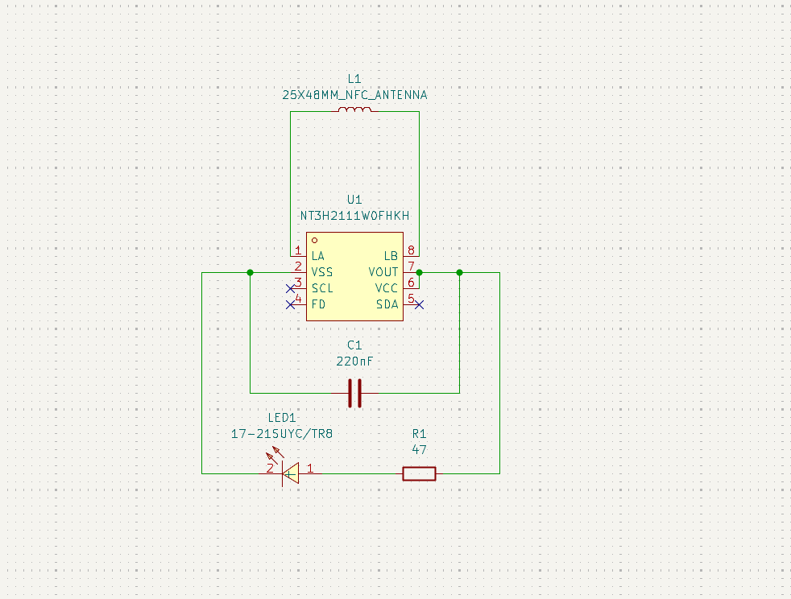
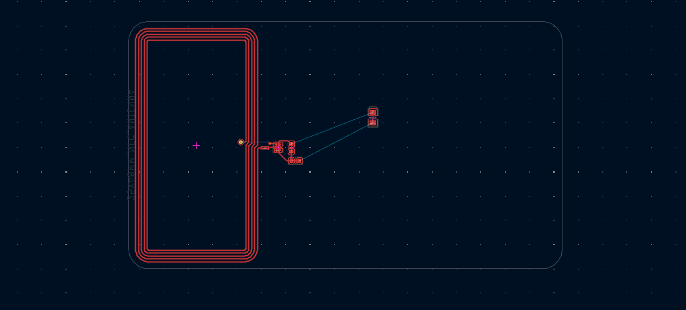
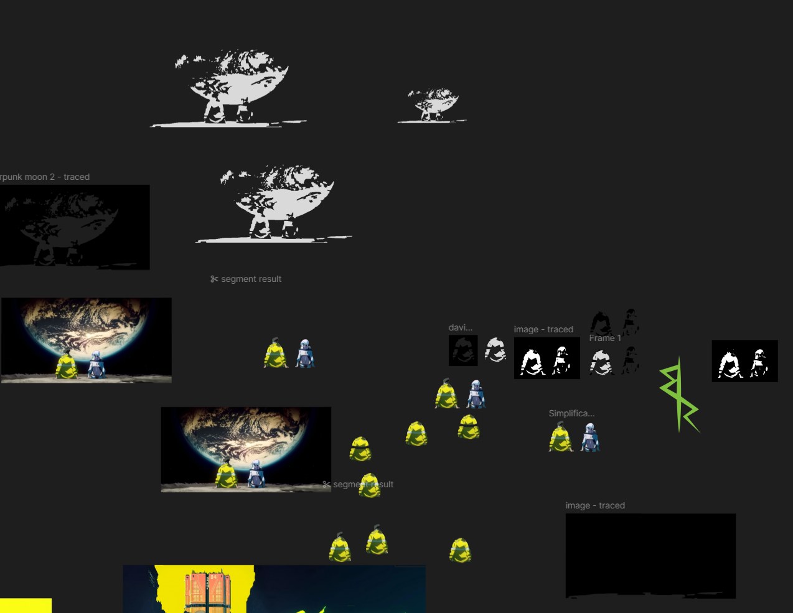

# July 29: Schematic and PCB Layout

I wanted to make a col hackercard before highway ends so I started up a new project and followed a guide on making an NFC Card. I wired the components up and then sent them over to the PCB. I then placed them in the general positions before wiring them up.

**Time Spent:** 1 Hours

# July 30: Art an Design

After wiring it up I went over to figma and created a new design to modify the artwork that I wanted to place. I ended up taking an image of David and Lucy on the moon from the Edgerunners series. I then added a cool wallpaper to the front along with the symbol on David's jacket. It was a pain to creat masks and then find out that the images in svg black and white didn't look good so I had to create many revisions.

**Time Spent:** 4 Hours
